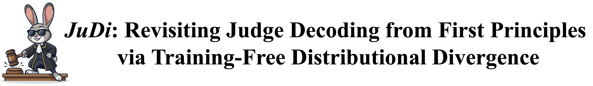


<div align="center">



<a href="https://arxiv.org/abs/2601.04766"></a>
<a href="https://2026.emnlp.org/"></a>
<a href="https://pytorch.org/"></a>

</div>

<br/>


This is the Pytorch implementation for our *EMNLP'26 Main Conference* paper: [**JuDi: Revisiting Judge Decoding from First Principles via Training-Free Distributional Divergence**](https://arxiv.org/abs/2601.04766). 

## Abstract
<div style="text-align: justify;">
  Judge Decoding accelerates LLM inference by relaxing the strict verification of Speculative Decoding, yet it typically relies on expensive and noisy supervision. In this work, we revisit this paradigm from first principles, revealing that the ``criticality'' scores learned via costly supervision are intrinsically encoded in the draft-target distributional divergence. We theoretically prove a structural correspondence between learned linear judges and Kullback-Leibler (KL) divergence, demonstrating they rely on the same underlying logit primitives. Guided by this, we propose a simple, training-free verification mechanism based on KL divergence. Extensive experiments across reasoning and coding benchmarks show that our method matches or outperforms complex trained judges (e.g., AutoJudge), offering superior robustness to domain shifts and eliminating the supervision bottleneck entirely.
<div> 
<br>



## Requirements

The PyTorch implementation uses Python 3.10 and the following key packages. This Transformers-based environment is used to measure mean accepted tokens (MAT) versus accuracy:
```shell
PyTorch==2.5.1
Transformers==4.53.1
Accelerate==1.10.1
NumPy==2.2.6
```
The vendored vLLM 0.8.3 runtime is tested separately with Python 3.10 and CUDA 12.4. This vLLM-based environment is used to measure token/s versus
accuracy. Its key packages include:
```shell
vLLM==0.8.3
PyTorch==2.6.0
Transformers==4.51.3
Triton==3.2.0
```
For the complete package versions and environment snapshots, see
[`./code/requirements.txt`](requirements.txt).

## Code Structure

```text
JuDi/
├── configs/                    # Experiment profiles and threshold settings
│   ├── profiles.json           # Model, dataset, and checkpoint profiles
│   └── thresholds.json         # Default AutoJudge and JuDi scan values
├── models/                     # Local models, datasets, and checkpoints
│   ├── target/                 # Target model weights
│   ├── draft/                  # Draft model weights
│   ├── datasets/               # GSM8K and LiveCodeBench data
│   └── checkpoints/            # AutoJudge classifier checkpoints
├── scripts/                    # Shell scripts to run the Transformers benchmarks
│   ├── run_gsm8k_core.sh       # Run one GSM8K method and threshold scan
│   ├── run_gsm8k_scan.sh       # Scan GSM8K thresholds
│   ├── run_lcb_core.sh         # Run one LiveCodeBench method and threshold scan
│   └── run_lcb_scan.sh         # Scan LiveCodeBench thresholds
├── src/code_judi/              # Core speculative-decoding implementation
│   ├── data/                   # Dataset loading and prompt formatting
│   ├── decoding/               # JuDi and AutoJudge decoding algorithms
│   ├── evaluation/             # Accuracy and benchmark evaluation
│   ├── models/                 # Model and checkpoint loading
│   ├── run_gsm8k.py            # GSM8K benchmark entry point
│   └── run_lcb.py              # LiveCodeBench benchmark entry point
├── vllm/                       # Vendored vLLM 0.8.3 JuDi integration
│   ├── judi_vllm/              # Runtime patch and vLLM benchmark code
│   ├── run_gsm8k_scan.sh       # vLLM GSM8K benchmark launcher
│   ├── requirements.lock.txt   # vLLM environment package versions
│   └── README.md               # vLLM preparation and runtime instructions
├── run_mat_acc.sh              # 🚀 Run here: Run the Transformers MAT/accuracy benchmarks
├── run_vllm.sh                 # 🚀 Run here: Run the vLLM token/s/accuracy benchmarks
├── requirements.txt            # Complete package versions and environment data
└── README.md                   # Main project documentation
```

## Compile and Run

Prepare the vendored vLLM runtime first, then run the benchmark scripts from
the project directory:

```shell
cd code
export VLLM_USE_V1=0
export PYTHONPATH="$PWD/vllm${PYTHONPATH:+:$PYTHONPATH}"
python -m judi_vllm.prepare
python -m judi_vllm.prepare --check
bash run_mat_acc.sh
bash run_vllm.sh
```

We provide the full datasets [here](https://drive.google.com/drive/folders/11AWIsaI5o9N36rJ0rN1azFG36fn2B_bk?usp=sharing). Due to storage limitations, please download them and place them in `./code/models/datasets`.

## Acknowledgment of Open-Source Code Contributions  

  This code is based on the open-source repository [AutoJudge](https://github.com/garipovroma/autojudge). Many thanks to the authors! 

You are welcome to cite our paper:
```
@inproceedings{SunLi26,
  title={{JuDi:} Revisiting Judge Decoding from First Principles via Training-Free Distributional Divergence},
  author={Shengyin Sun, Yiming Li, Renxi Liu, Weizhe Lin, Hui-Ling Zhen, Xianzhi Yu, Mingxuan Yuan, Chen Ma},
  booktitle={arXiv:2601.04766},
  year={2026}
}
```
